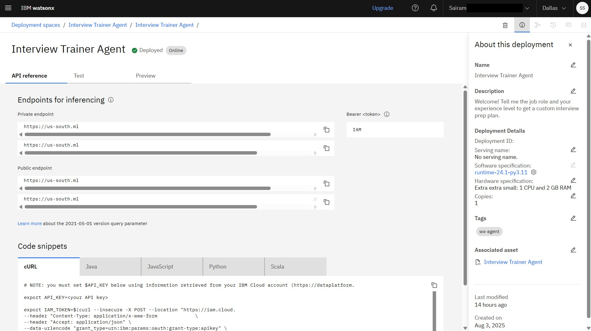
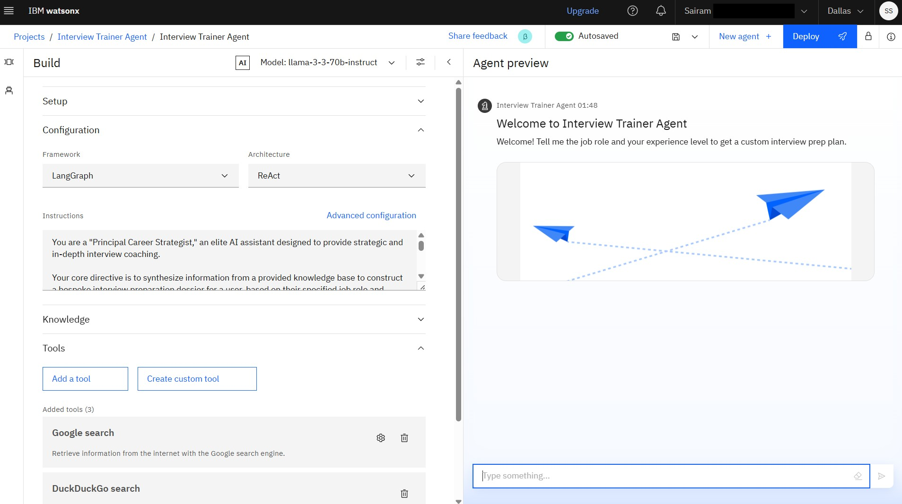
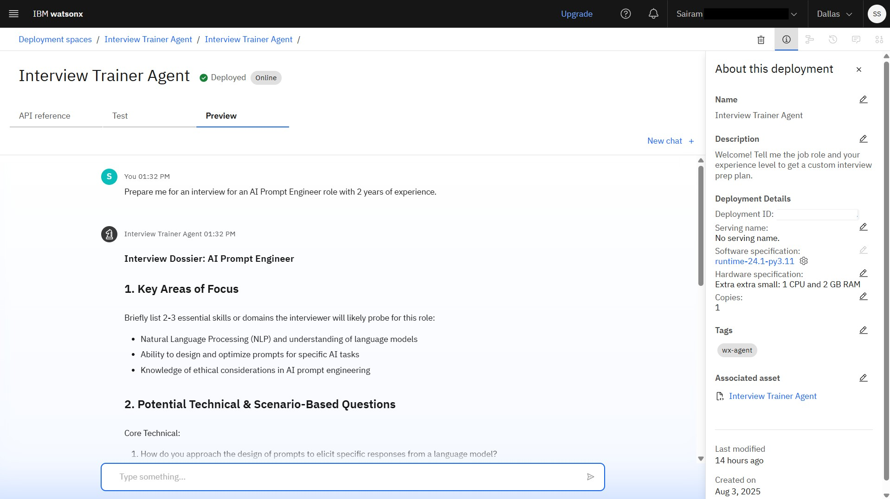

# Interview Trainer Agent

This project is an advanced AI-powered assistant designed to prepare users for job interviews. Leveraging the **Llama 3 model** on IBM's **watsonx.ai** platform, the agent provides a personalized and strategic preparation experience based on a user's specified job role and experience level.

---

## Key Features

-   **Personalized Prep Plans:** Generates custom interview dossiers tailored to specific job roles and experience levels.
-   **RAG-Powered Insights:** Uses a Retrieval-Augmented Generation (RAG) architecture to pull from a dedicated knowledge base of job descriptions, technical questions, and interview strategies.
-   **Strategic Guidance:** Provides not just questions, but also key areas of focus, what questions the candidate should ask, and high-impact preparation tips.
-   **Cloud-Native Deployment:** Deployed as a secure and scalable API endpoint on IBM Cloud, ready for integration into other applications.

---

## Architecture & Technology

-   **Platform:** IBM Cloud
-   **Core Service:** IBM watsonx.ai (AI Studio)
-   **Foundation Model:** `llama-3-70b-instruct`
-   **Architecture:** Retrieval-Augmented Generation (RAG)
-   **Knowledge Base:** The agent is connected to a knowledge base containing documents on:
    -   Real-world Job Descriptions (e.g., AI Prompt Engineer, MLOps Engineer)
    -   Technical and Conceptual Interview Questions
    -   Behavioral and Situational Questions
    -   Proven Answering Strategies (like the STAR method)
-   **Deployment:** IBM Cloud Deployment Space

---

## How It Works

The agent follows a sophisticated RAG workflow to generate its response:

1.  **User Prompt:** The agent receives a prompt from the user, such as "Prepare me for a Full Stack Developer role."
2.  **Knowledge Retrieval:** It searches its vector index (knowledge base) to find the most relevant documents related to the user's request.
3.  **Prompt Augmentation:** It synthesizes the user's request with the retrieved information into a detailed, structured prompt for the foundation model. This prompt is guided by the advanced "Agent Instructions" provided during setup.
4.  **Response Generation:** The `llama-3-70b-instruct` model processes the augmented prompt and generates the final, structured "Interview Dossier" for the user.

---

## How to Use the Deployed Agent

The deployed agent is accessible via an API endpoint. To interact with it, you would send a POST request with your API key and input.

**Sample Python Code:**

```python
import requests

# NOTE: Replace with your actual API key and endpoint URL from the deployment
IAM_API_KEY = "YOUR_IBM_CLOUD_API_KEY"
ENDPOINT_URL = "YOUR_DEPLOYMENT_ENDPOINT_URL"

# Get an IAM token
token_response = requests.post(
    "[https://iam.cloud.ibm.com/identity/token](https://iam.cloud.ibm.com/identity/token)",
    headers={"Content-Type": "application/x-www-form-urlencoded"},
    data={"grant_type": "urn:ibm:params:oauth:grant-type:apikey", "apikey": IAM_API_KEY}
)
iam_token = token_response.json()["access_token"]

# Define the payload for the agent
payload = {
    "input": "Prepare me for a Senior Data Analyst interview"
}

# Send the request to the agent
response = requests.post(
    ENDPOINT_URL,
    headers={
        "Authorization": f"Bearer {iam_token}",
        "Content-Type": "application/json"
    },
    json=payload
)

if response.status_code == 200:
    print(response.json())
else:
    print(f"Error: {response.status_code}, {response.text}")

---

## Deployment Screenshots

### Agent Deployed on IBM Cloud


### Agent Configuration & Custom Instructions


### Agent in Action (Preview)

